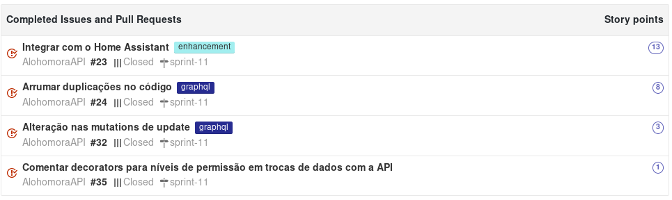

## Contexto

Sprint passada finalizamso as principais interações. Nesta sprint iremos concentrar em terminar a integração via IOT (parte principal do projeto). Para isso vamos utilizar o home assistant. Outro aspecto que já iremos atacar é as métricas de código como duplicações e cobertura.

## Tarefas

## Review

## pontos positivos

* terminou a prova de md2
* terminou os projetos de EDA
* resolvemos algumas pendências anterioes
* conseguimos fazer testes no bot

## pontos negativos

* dividas tecnicas novamente
* não conseguimos render muito nessa semana
* algumas pendencias muito grande para fazer que estão virando bola de neve
* o código não esta muito legivel

## pontos de melhoria

* diminuir a carga de trabalho para que as issues tenham mais atenção
* cobrar colocar os problemas na issue
*  começar mais cedo as atividades
* planejar tarefas para resolver pendencias de code climate, code style, organizaçãos dos arquivos

## Notas do Scrum master

Nessa sprint conseguimos normalizar a análise de código estatíco que estava quebrada nas últimas sprints. Outra grande novidade é que criamos um banco de dados no bot para que a notificação possa se codificada de forma mais fácil (salvando o chat id).
