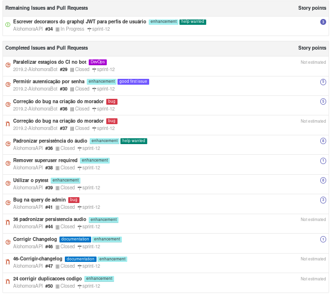

## Contexto

Nosso objetivo nessa sprint é derecionar para o final do projeto. Iremos arrumar vários pequenos aspectos do projeto como documetação, integração continua e outros.

## Tarefas

## Review

## Pontos positivos

* Conseguimos resolver o problema com o docker do bot
* Realizamos build paralela (agora podemos ver quais fases estão quebrando)
* Felipe conseguiu arrumar o pc 
* Conseguimos melhorar bastante a documentação
* Realizamos interação do morador e visitante
* A tarefa de do documento arquitetura foi bem comentada
* A ajuda de EPS foi alta no documento de arquitetura

## Pontos negativos

* Comunicação no repositório não condiz com o trabalho feito
* EPS foi ausente nas revisões nesta sprint
* Mais dividas técnicas
* Falta de comunicação nas issues (issues que não foram comentadas porém foram criadas)
* Muito trabalho fora da matéria
* Felipe tem que aprender a usar o dd 

## Melhorias

* paralelizar integração do bot
* resolver problemas do lint
* Realizar deploy continuo
* Adicionar webhook no bot
* Marcar EPS nas issues 
* PR deverão ser obrigatoriamente revisados nas terças e quintas.

## Notas Scrum Master

Essa sprint foi completado uma série de melhorias marginais do projeto. No geral o grande problema evidenciado nessa sprint foram o acompanhamento das issues por parte de EPS e também uma série de issues que foram planejadas e não foram completadas por parte de MDS.
