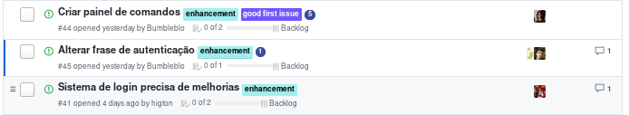

## Contexto

Última sprint do projeto ligado a matéria. Apenas estamos limpando a casa e organizando a apresentação.

## Tarefas

## Review

## Pontos negativos

* Não completamos autenticação de serviços
* Muita gente faltou na daily de quarta sem justificativa
* documentação ainda não esta em dia

## Pontos positivos

* as issues foram bem comentadas 
* as revisões tão em dia
* conseguimos integrar com o home assistant

## Melhorias

* próxima sprint iremos focar na documentação uma vez que as funcionalidades principais foram cumpridas
* a daily de quarta-feira será remota pois a maior parte dos integrantes não estarão na faculdade nesse momento e não terão compromissos posteriores ou anteriores.

## Notas Scrum Master

WIP
