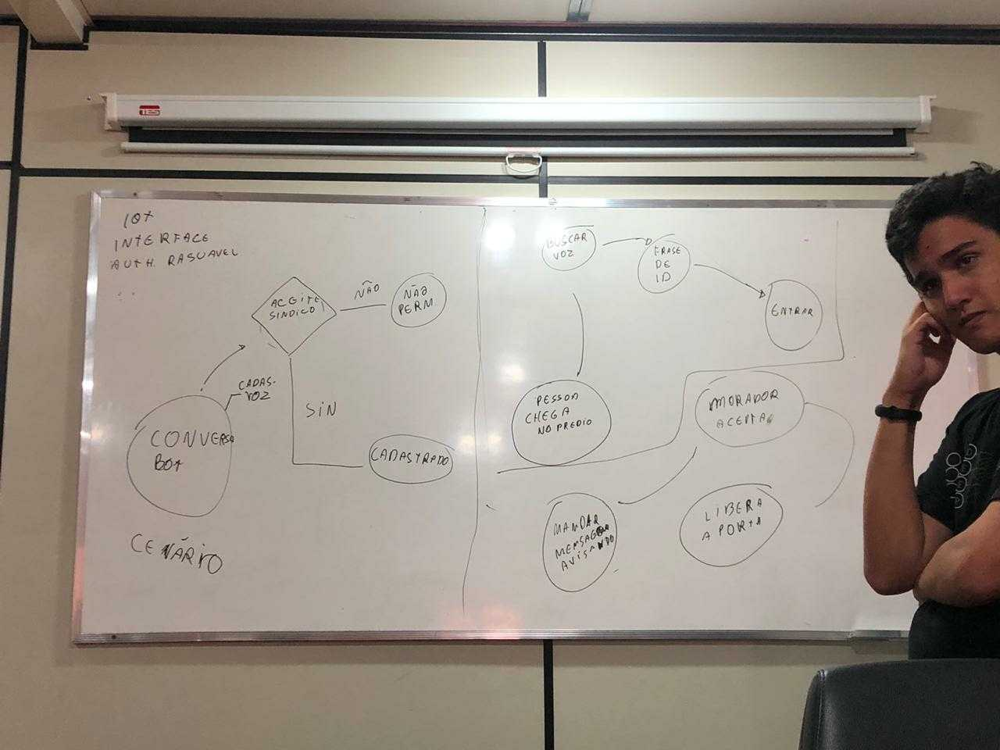

## Contexto

Essa semana começamos o planejamento realizando um brainstorm (foto abaixo). Determinamos todas as interações que faltam para concluir o projeto e agora iremos ataca-las.

## Review

## Pontos negativos 

* muitas issues com dependências entre elas
* semana de prova
* repositórios bagunçados
* eps sumiu
* discrepancia entre participação de eps 
* pipeline quebradas
* repositório ainda não foram configurados

## Pontos positivos

* Acabou a migração dos repositório 
* mds revisou vários prs nessa sprint

## Melhorias

* Finalizar configurações menores dos repositórios
* estipular data para revisão 
* reorganizar as pipeline de integração continua
* configurar repositório Pages

## Notas do Scrum master.

Essa semana tivemos várias contra tempos nas revisões o que gerou um monte de dividas técnicas. Estamos estipulando os dias de terça e quinta feira para realizar revisões dos repositórios (já que deixar solto não esta sendo uma boa alternativa). A parte de IoT ainda não foi atacada, contactamos pessoas que trabalham na área para nós ajudar a entender o melhor jeito de integrar o nosso sistema a esse cnotexto.
